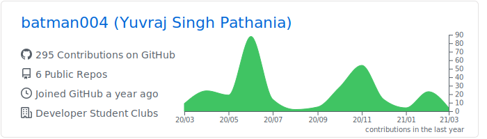
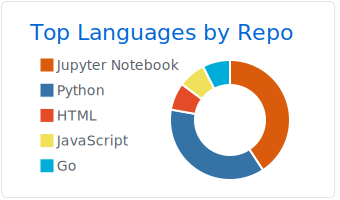
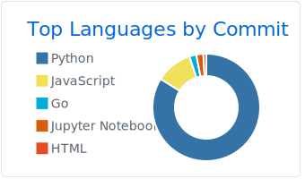
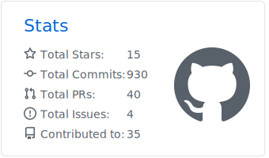

### Hi there 👋

 
- I’m currently working on a FARM Stack Project
- Learning about creating efficient and scalable backend services 
- I have experience with Machine Learning as well as Web Dev projects.
- I’m looking to collaborate on involving backend work or building ML projects
- Always ready to learn more Distributed/Cloud Computing
- Fun fact: I'm a part-time DJ 

