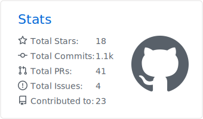

### Hi there 👋

 
- I’m currently working on a Golang based CLI project
- Learning about creating efficient and scalable backend services 
- I have experience with Machine Learning as well as Web Dev projects.
- I’m looking to collaborate on developing backend architecture or building ML models
- Always ready to learn more Distributed/Cloud Computing 
- Fun fact: I'm a part-time DJ/Music Producer : [Spotify](https://open.spotify.com/artist/5heeZ3Y9a70C5zKScFN1y4?si=iq9VZ6CETT6IqkBVUcbK2g)

