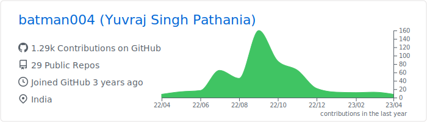
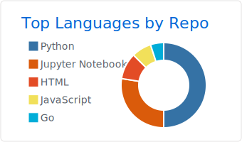
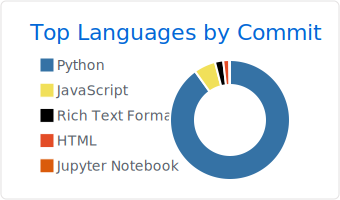

### Hi there 👋

 
- I’m currently working on a Django Project
- Learning React, Django
- I have experience with Machine Learning as well as Web Dev projects.
- I’m looking to collaborate on building ML projects or involving backend work
- I’m looking for help with building REST APIs
- How to reach me: pathania.yuvraj@gmail.com 
- Fun fact: I'm a part-time DJ 

